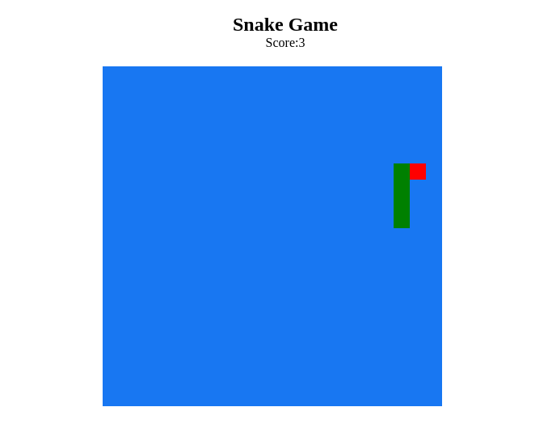

<p align="center">
  
</p>
<h1 align='center'>🚀 Snake Game :snake:  🚀 </h1>
A clone of the snake game, where it can cross all sides without dying, with each fruit eaten, the score increases, and if you bite the body is game over.
<h2>Layout</h2>
  
<h2>How to run this repo: 🚀</h2>

```bash

# Clone this repo
$ git clone git@github.com:SMarkus27/Snake-Game.git

# Open the project folder in the terminal/cmd
$ cd Snake-Game

# Run the index file in your browser:
$ index.html


```

<h2>Tech Stack</h2>
<ul>
  <li>HTML5</li>
  <li>CSS3</li>
  <li>JavaScript</li>
</ul>
 📝 License

This project is under license [MIT](./LICENSE).

Made by Marcus Vinicius 👋🏽 [Get in touch!](https://www.linkedin.com/in/marcus-vinicius-campos=pereira)
